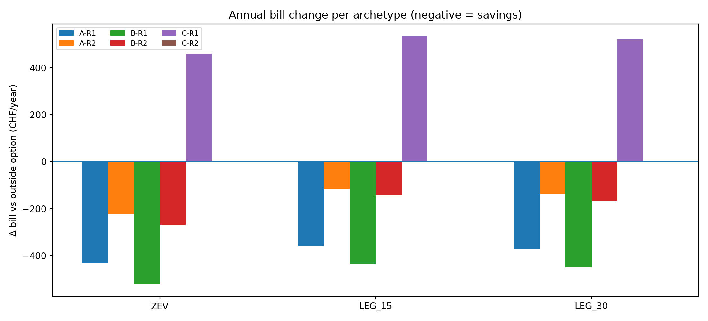
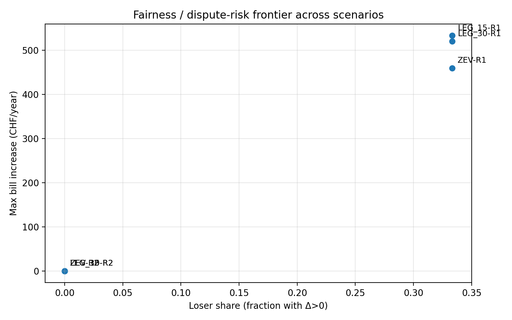

# ZEV/LEG settlement-rule MVP simulator (Python)

A concise, reproducible simulator to support a Swiss ZEV/LEG thesis on settlement-rule design and dispute-risk metrics. It compares proportional allocation (Rule 1) with a no-harm, budget-balanced rule (Rule 2) across ZEV versus LEG grid-usage treatments.

## Scope & claims
- Synthetic hourly load/PV profiles are used; no smart-meter data is included.
- Tariff inputs are simplified parameters in `configs/default.json`, tunable for experiments.
- Results illustrate method and sensitivity rather than replicating any specific DSO bill.
- Figures and CSVs are regenerated with one command (`run.bat` or `run.sh`).

## Swiss regulatory context (high-level)
- **ZEV**: behind-the-perimeter self-consumption community; grid charges apply on net import at the perimeter.
- **LEG**: PV shared via the public grid; the shared-to-others portion faces reduced network charges under LEG discounts.
- This repository is a prototype for a thesis exploring settlement rules and dispute-risk metrics under Swiss regulatory and tariff constraints.
- Descriptions are indicative only; it is not a compliance or legal-interpretation tool.

## Interpretation guide
- Data source: synthetic hourly profiles plus configurable tariff parameters in `configs/default.json`.
- What is validated: method and reproducibility; not empirical Swiss billing accuracy (yet).
- Why ZEV vs LEG differs: grid-usage treatment (netting behind perimeter vs discounted shared-through-grid energy).
- Next step: plug in official ElCom tariff components (via LINDAS/SPARQL) and broaden archetypes/sensitivity.

## Economic formulation (minimal)

```latex
\text{Actors } i \in \{A,B,C\};\ b_i^{\text{out}},\ B^{\text{comm}},\ x_i
\text{Rule 1: } x_i = \frac{g_i}{\sum_j g_j} B^{\text{comm}},\ g_i = \text{gross consumption}
\text{Rule 2 constraints: } x_i \le b_i^{\text{out}} \ (\text{no-harm}),\ \sum_i x_i = B^{\text{comm}} \ (\text{budget balance})
```

## Quick start

**macOS / Linux (bash/zsh)**
```bash
cd "$(dirname "$0")"
./run.sh
```
_If needed: `chmod +x run.sh` once._

**Windows (PowerShell)**
```powershell
cd $PSScriptRoot  # or: cd path\to\repo
.\run.bat
```
Both scripts create `.venv` if missing, install `requirements.txt`, run `scripts/run_mvp.py`, and write outputs into `outputs/`.

Manual fallback (all platforms, after `cd` to repo):
```bash
python -m venv .venv
source .venv/bin/activate  # Windows: .venv\Scripts\Activate.ps1
pip install -r requirements.txt
python scripts/run_mvp.py
```

## Results (figures)

  
*Annual delta bill per archetype (A/B/C) for each scenario under Rule 1 vs Rule 2; bars below zero are savings.*

  
*Fairness / dispute-risk frontier: loser share vs max bill increase, labeled by scenario and rule.*

### Outputs produced
- `outputs/graph1_bill_change.png` - annual delta bill per archetype (A/B/C) for each scenario and rule.
- `outputs/graph2_fairness_frontier.png` - scatter of loser share vs max increase (fairness/dispute-risk frontier) with labels.
- `outputs/scenario_summary.csv` - compact table per scenario/rule with fairness metrics.
- `outputs/scenario_details.csv` - long-form table per scenario/rule/actor with bills and deltas.

The default configuration lives in `configs/default.json`. Adjust tariff levels, profile parameters, or scenario definitions there and re-run to regenerate the four outputs.

## How the model works

**Archetypes (synthetic, 1 year, hourly resolution)**
- A: inflexible household with an evening-peaking demand shape.
- B: flexible household; same base load plus EV/heat-pump energy shifted toward midday PV hours.
- C: PV prosumer; household load plus rooftop PV generation (PV treated as a community asset in the community case).

**Tariff structure**
- Energy price (CHF/kWh), grid-usage charge (CHF/kWh), feed-in remuneration for exported PV (CHF/kWh) - all set in `configs/default.json`.

**ZEV vs LEG**
- ZEV: internal PV sharing is behind a single perimeter; grid usage applies only on net import at the perimeter.
- LEG: PV shared from the prosumer to other meters uses the public grid. Net import pays full grid usage, and the shared-to-others PV portion pays grid usage multiplied by a discount factor (e.g., 15% or 30%). The discount applies only to that shared-to-others portion.

**Settlement rules (inside the community)**
- Rule 1 - proportional allocation: community utility-bill cost is allocated to A/B/C in proportion to gross annual consumption.
- Rule 2 - no-harm, budget-balanced: no one pays more than their outside option (what they would pay alone); caps for harmed participants are funded from winners' savings; totals remain equal to the community bill.

**Fairness metrics**
- Delta bill per actor: community bill minus outside-option bill (negative = savings, positive = harm).
- Loser share: fraction of actors with delta bill > 0.
- Max increase: largest positive delta bill (proxy for dispute-risk severity).

## Scenarios

The demo runner evaluates three scenarios from `configs/default.json`:
- `ZEV`
- `LEG_15` (LEG with 15% discount on the shared-to-others PV grid-usage portion)
- `LEG_30` (LEG with 30% discount)

Each scenario is evaluated under both settlement rules; results are exported to `outputs/`.

## Data integration plan (thesis)
- Tariff inputs can be sourced from ElCom tariff datasets (via LINDAS/SPARQL) in the thesis phase.
- Legal alignment references Fedlex + BFE explanatory report.
- Additional archetypes or sensitivity sweeps can be added once supporting data is curated.

## Next steps (thesis roadmap)
- Add sensitivity sweeps with more archetypes and parameter ranges (flex share, PV size, discounts).
- Optional: swap synthetic profiles for measured or standardised profiles when available.
- Run robustness checks (rounding, infeasible/no-harm edge cases, weather variability).

## GitHub / repo hygiene

`.gitignore` ignores the local virtual environment (`.venv/`), Python bytecode (`__pycache__/`, `*.pyc`), generated outputs (`outputs/`), and macOS metadata (`.DS_Store`). Figures in `docs/*.png` are tracked so the README renders on GitHub; `outputs/` stays gitignored to keep the repo light.
